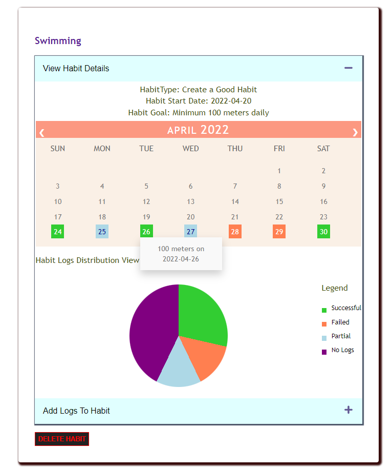
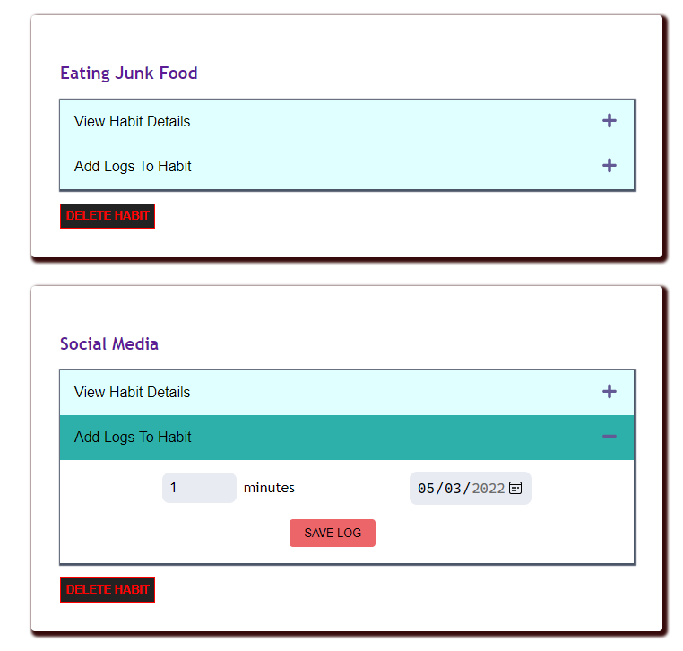
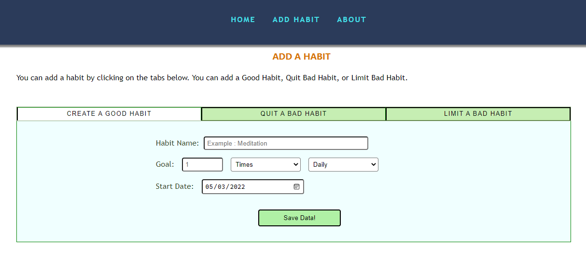

# HABITIZER

This is a simple Habit tracking application, allows user to create an account, login to the page and View Habits, Add habits and Add logs.
There are 3 types of habits

1. Create a Good Habit
2. Limit a Bad Habit
3. Quit Bad Habit

User can also add the logs to the habits created.

#### For Testing, you can either create a new account in the signup page, or use the following credentials of the test account

**username: john.doe@gmail.com** 
**password: hello@123**

## Some of the Screenshots of the Application

### View the Calendar & Pie chart of a Habit

### Add a Log for the Habit

### Create a new Habit

### Update the User Profile

## Backend

### User Related APIs:

1. /v1/user :

    - `POST` : This api creates an user if doesn't exist. A new user has to create an account with emailId, password, FirstName and LastNames
      When an account is created, a Json file will be created in the server to store the user credentials.

    - `GET` : This api gets information about the user stored in the file.

    - `PUT` : If user want to edit any of his information like FirstName, LastName or Password, He/she can update the information, and the same will be updated in the use_file.

    - `DELETE` : When the user deletes the account the file created will also be deleted and the session will be removed, Hence, the user is redirected to Login Page

2. `/v1/user/login`:

    - `POST` : If the user has an account created, then user has to Login with the credentials to legitimately use the web application. A session/cookie is created for the user every time he logs in and an authentication is done to check the validity of the sessionId before the user make any backend call. If the session id is expired/corrupted the user will be redirected to Login page.

3. `/v1/user/logout`:
    - `POST` : A Logged In user can logout, and the sessionId is deleted.

### Habits Related APIs

1. `/v1/user/habits` :

    - `POST` : This api is used to create a habit for the user. As mentioned there are 3 types of habits. Based on the type of the habit the user have to fill in the details asked to create a habit. When a habit is created we will store the date in the JSON file for the user.

        - **CREATE A GOOD HABIT** : If the use wants to create a Good habit then, HabitName, Goal, Unit, Duration and StartDate are the required field.
        - **LIMIT A BAD HABIT**: If the use wants to create a Limit a Bad habit then, HabitName, Goal, Unit, Duration and StartDate are the required field.
        - **QUIT A BAD HABIT** : If the habit type is Quit a Bad Habit, then user needs to enter the Habit name and start date to create a habit.

    - `GET` : When the user logs in and see the home page all the habits which are previously created will be displayed.

    - `DELETE` : User can delete all the habits at once, this resets the data. All the habit related files created for ths user will be deleted.

2. `/v1/user/habits/:habitId` :

    - `GET` : When user clicks on specific Habit, The details about the habits can be viewed, Details in the sense the type, name and start date of the habit
    - `DELETE` : Deleting a single habit is possible, by deleting single habit the habit file created in the backend will be deleted.

3. `/v1/user/habits/:habitId/log`:

    - `POST` : The logging of data for each habit will vary w.r.t the type of Habit. A separate log file will be created for the user and data will be appended to the file every time a new log entry is made.

        - **CREATE A GOOD HABIT** : If the use wants to create the log for Good habit then, are duration and Date the required field.
        - **LIMIT A BAD HABIT**: If the use wants to create the log for Limit a Bad habit then, duration and Date are the required field.
        - **QUIT A BAD HABIT** : If the use wants to create the log for Quit a Bad habit then, isSuccessful or not and Date are the required field.

    - `GET` : User can see the logs made for individual habits, also track them by seeing the pie chart representation of the habit logs in the front end.

## Frontend

1. **Login and SignUp pages** : If the user is new, then user has to sign-up and enter the details. After that user needs to Login with the username and password.

1. **HomePage** : Has a Navigation bar, that routes the user to HomePage(default), Add Habit Page, About Page and User Profile page

    In the Home Page user can see all the Habits entry which were previously made. 2 Accordions are created, one to View the Habit Details other one to Add the logs to the Habit.

1. **ViewHabitAccordion** : User can see the type of habit, start date and other related data. This accordion also has a calender view to see on which all days the user logged the habit details, this also has a Pie-chart representation to track how many days the user missed to log the details and how many days the partial goal achieved etc.

1. **LogHabitDetailsAccordion**: Here the user can add logs to the specific Habit

1. **AddHabitPage**: In the page toggle tabs feature is enables for the user to easily choose the HAbitType and create a habit.

1. **Modals**: Modal components are used to tell the user if any dangerous operation is made.
   Example: Deleting account, Deleting all Habit Data etc
